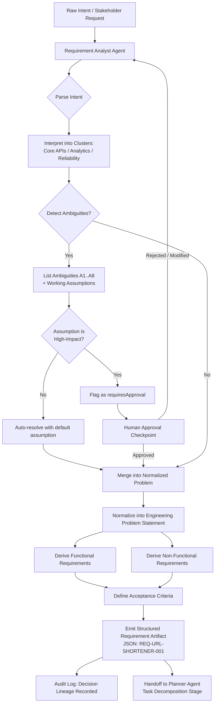
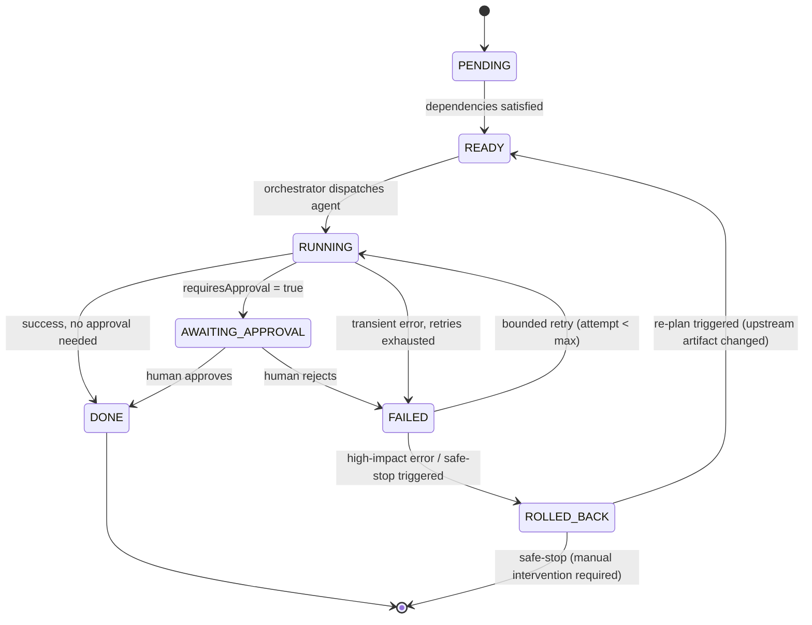
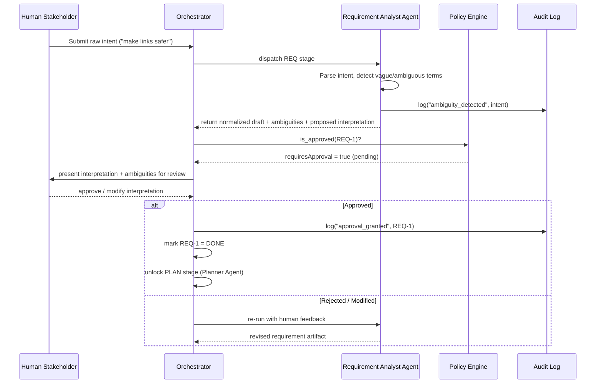

# Flow Diagrams — Agentic SDLC Orchestrator (URL Shortener)

## 1. Requirement Understanding — Process Flow



---

## 2. Overall SDLC Orchestration — Dependency Graph

```mermaid
flowchart LR
    subgraph REQ["REQUIREMENTS"]
        R1[Requirement Analyst Agent]
    end
    subgraph PLAN["TASK DECOMPOSITION"]
        P1[Planner Agent]
    end
    subgraph DES["DESIGN"]
        D1[Architect / Design Agent]
        D2[Codebase Reasoning Agent\n(Brownfield only)]
    end
    subgraph IMPL["IMPLEMENTATION"]
        I1[Dev Agent: Controller]
        I2[Dev Agent: Service]
        I3[Dev Agent: Repository]
    end
    subgraph VAL["TESTING & DOCS (parallel)"]
        T1[Test Agent]
        T2[Documentation Agent]
        T3[Risk & Validation Agent]
    end
    subgraph REL["RELEASE READINESS"]
        REL1[Release Agent]
    end

    R1 -->|"Approval Gate"| P1
    P1 --> D2
    D2 --> D1
    P1 --> D1
    D1 -->|"Approval Gate"| I1
    D1 --> I2
    D1 --> I3
    I1 --> T1
    I2 --> T1
    I3 --> T1
    I1 --> T2
    I2 --> T2
    I3 --> T2
    T1 --> T3
    T2 --> T3
    T3 -->|"Approval Gate"| REL1
    REL1 --> DONE[Final Engineering Summary]

    classDef gate fill:#f96,stroke:#333,stroke-width:1px;
```

**Legend:**
- Solid arrows = dependency (`dependsOn`)
- Nodes within the same subgraph row execute **in parallel** once their shared dependency is satisfied (e.g., Controller/Service/Repository dev agents; Test/Docs agents)
- "Approval Gate" = human checkpoint required before proceeding (`requiresApproval: true`)

---

## 3. Orchestrator State Machine (per task node)



---

## 4. Requirement Understanding — Sequence Diagram (Ambiguous Scenario Example)



---

*Diagrams rendered with Mermaid — viewable directly in GitHub, VS Code (Markdown Preview Mermaid Support), or any Mermaid-compatible renderer.*
