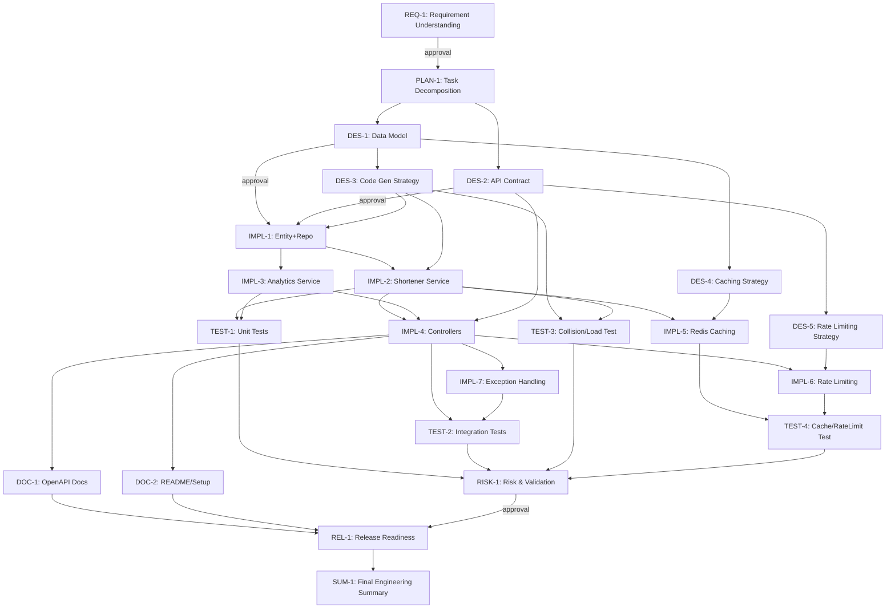

# Task Decomposition Document
## Agentic SDLC Orchestrator — URL Shortener Service

**Stage:** TASK DECOMPOSITION
**Agent:** Planner Agent
**Input:** Normalized Requirement Artifact `REQ-URL-SHORTENER-001` (see `01-requirement-understanding.md`)
**Purpose:** Convert the normalized engineering problem into a concrete, executable set of tasks — each with clear scope, owning agent, dependencies, sequencing, parallelism, and approval gates — expressed as a dependency graph rather than a flat list.

> **Implementation cross-reference:** This task graph is implemented as machine-readable workflow specs and executable code under `..\agentic-orchestrator\`:
> - Task graph (this document, Section 2/3) → `agentic-orchestrator\orchestrator\specs\greenfield.yaml` (loaded and validated at runtime by `core\graph.py`)
> - Owning agents (Planner/Architect/Dev/Test/Documentation/Risk/Release) → `agentic-orchestrator\orchestrator\agents\*.py`, wired via `agents\registry.py`
> - Approval gates (Section 5) → enforced by `agentic-orchestrator\orchestrator\core\policy.py` (`PolicyEngine.request_approval`)
> - Re-planning triggers (Section 6) → `WorkflowGraph.invalidate_downstream()` in `core\graph.py`
> - Resulting Spring Boot artifacts (`IMPL-*` tasks) → `agentic-orchestrator\service\src\main\java\com\example\urlshortener\`
>
> See `agentic-orchestrator\orchestrator\README.md` for how to run this task graph end-to-end.

---

## 1. Decomposition Principles

- Every task maps to exactly one FR/NFR/acceptance criterion from the requirement artifact (traceability).
- Tasks are grouped into SDLC **stages**; tasks within a stage may run **sequentially or in parallel** depending on data dependency, not stage boundary alone.
- High-impact tasks (schema changes, release actions, scope-affecting design decisions) carry `requiresApproval: true`.
- Each task declares `dependsOn` explicitly — no implicit ordering. This allows the orchestrator to compute a true DAG, detect parallelizable branches, and support re-planning if an upstream task's output changes.

---

## 2. Task List (Actionable, Traceable)

| Task ID | Stage | Description | Owning Agent | Depends On | Requires Approval | Traces To |
|---|---|---|---|---|---|---|
| REQ-1 | Requirements | Interpret intent, resolve ambiguities, normalize problem statement | Requirement Analyst Agent | — | Yes | REQ-URL-SHORTENER-001 |
| PLAN-1 | Task Decomposition | Decompose requirement into task graph (this document) | Planner Agent | REQ-1 | No | REQ-URL-SHORTENER-001 |
| DES-1 | Design | Define data model: `ShortUrl` entity (code, originalUrl, createdAt, expiryAt) | Architect/Design Agent | PLAN-1 | Yes | FR1, FR6, FR7, A1, A3, A7 |
| DES-2 | Design | Define REST API contract (OpenAPI): shorten, redirect, analytics endpoints | Architect/Design Agent | PLAN-1 | Yes | FR1–FR5, NFR6 |
| DES-3 | Design | Define Base62 short-code generation strategy + collision handling | Architect/Design Agent | DES-1 | No | NFR2 |
| DES-4 | Design | Define caching strategy for redirect hot path (Redis) | Architect/Design Agent | DES-1 | No | NFR1 |
| DES-5 | Design | Define rate-limiting strategy for `/shorten` | Architect/Design Agent | DES-2 | No | NFR4 |
| IMPL-1 | Implementation | Implement `ShortUrl` entity + repository (JPA) | Dev Agent: Repository | DES-1, DES-3 | No | FR1, FR6, FR7 |
| IMPL-2 | Implementation | Implement `UrlShortenerService` (create, resolve, dedup, expiry check) | Dev Agent: Service | IMPL-1, DES-3 | No | FR1, FR3, FR6, FR7 |
| IMPL-3 | Implementation | Implement `AnalyticsService` (click tracking, counters) | Dev Agent: Service | IMPL-1 | No | FR4 |
| IMPL-4 | Implementation | Implement REST Controllers (`/shorten`, `/{code}`, `/analytics/{code}`) | Dev Agent: Controller | IMPL-2, IMPL-3, DES-2 | No | FR1–FR4 |
| IMPL-5 | Implementation | Implement caching layer (Redis) for redirect lookups | Dev Agent: Service | IMPL-2, DES-4 | No | NFR1 |
| IMPL-6 | Implementation | Implement rate-limiting filter/interceptor | Dev Agent: Controller | IMPL-4, DES-5 | No | NFR4 |
| IMPL-7 | Implementation | Implement global exception handling + validation (4xx responses) | Dev Agent: Controller | IMPL-4 | No | FR3, FR5 |
| TEST-1 | Testing | Unit tests: service layer (dedup, expiry, code generation) | Test Agent | IMPL-2, IMPL-3 | No | FR1, FR3, FR6, FR7 |
| TEST-2 | Testing | Integration tests: controller endpoints (happy path + error path) | Test Agent | IMPL-4, IMPL-7 | Yes | FR1–FR5 |
| TEST-3 | Testing | Load/collision test: Base62 generation under concurrency | Test Agent | DES-3, IMPL-2 | No | NFR2 |
| TEST-4 | Testing | Rate-limit and cache behavior tests | Test Agent | IMPL-5, IMPL-6 | No | NFR1, NFR4 |
| DOC-1 | Documentation | Generate OpenAPI/Swagger docs from controller annotations | Documentation Agent | IMPL-4 | No | NFR6 |
| DOC-2 | Documentation | Write README + setup instructions | Documentation Agent | IMPL-4 | No | Deliverables |
| RISK-1 | Validation & Risk | Identify risks, trade-offs, failure scenarios; define validation plan | Risk & Validation Agent | TEST-1, TEST-2, TEST-3, TEST-4 | No | Core Req. #6 |
| REL-1 | Release Readiness | Compile release notes, rollback plan, final go/no-go checklist | Release Agent | DOC-1, DOC-2, RISK-1 | Yes | Deliverables |
| SUM-1 | Final Summary | Generate Final Engineering Summary artifact | Orchestrator | REL-1 | No | Core Req. #8 |

**Note on current implementation status:** The v1 implementation (`agentic-orchestrator\service\`) delivers `IMPL-1`, `IMPL-2`, `IMPL-4`, `IMPL-7`, `TEST-1`, `TEST-2` as real, runnable code with endpoints `POST /api/v1/urls` and `GET /api/v1/urls/{shortCode}`. `IMPL-3` (analytics), `IMPL-5` (Redis caching), `IMPL-6` (rate limiting), `DES-4`/`DES-5` are represented in the orchestrator's design-agent output (`specs/greenfield.yaml`) but not yet built into the service — tracked as follow-up work.

| Task ID | Generated Source File(s) |
|---|---|
| IMPL-1 | `service\...\entity\UrlMapping.java`, `service\...\repository\UrlMappingRepository.java` |
| IMPL-2 | `service\...\service\UrlShortenerService.java`, `service\...\util\Base62Encoder.java` |
| IMPL-4 | `service\...\controller\UrlController.java`, `service\...\dto\CreateUrlRequest.java`, `service\...\dto\UrlResponse.java` |
| IMPL-7 | `service\...\exception\GlobalExceptionHandler.java`, `service\...\exception\ShortUrlNotFoundException.java` |
| TEST-1 | `service\src\test\...\service\UrlShortenerServiceTest.java` |
| TEST-2 | `service\src\test\...\controller\UrlControllerTest.java` |

*(All paths relative to `agentic-orchestrator\`.)*

---

## 3. Dependency & Sequencing Diagram



**Parallel execution groups** (tasks that can run concurrently once their shared prerequisite is met):
- Group P1: `DES-3`, `DES-4` (both depend only on `DES-1`)
- Group P2: `IMPL-2`, `IMPL-3` (both depend only on `IMPL-1`)
- Group P3: `IMPL-5`, `IMPL-6`, `IMPL-7` (independent branches off `IMPL-4`/design outputs)
- Group P4: `TEST-1`, `TEST-2`, `TEST-3`, `TEST-4` (independent test suites, join at `RISK-1`)
- Group P5: `DOC-1`, `DOC-2` (independent docs, join at `REL-1`)

---

## 4. Task Spec Format (Machine-Readable, Orchestrator Input)

```yaml
tasks:
  - id: DES-1
    stage: DESIGN
    description: "Define data model: ShortUrl entity"
    owningAgent: ArchitectAgent
    dependsOn: [PLAN-1]
    requiresApproval: true
    tracesTo: [FR1, FR6, FR7, A1, A3, A7]

  - id: IMPL-2
    stage: IMPLEMENTATION
    description: "Implement UrlShortenerService"
    owningAgent: DevAgent-Service
    dependsOn: [IMPL-1, DES-3]
    requiresApproval: false
    tracesTo: [FR1, FR3, FR6, FR7]

  - id: TEST-2
    stage: TESTING
    description: "Integration tests: controller endpoints"
    owningAgent: TestAgent
    dependsOn: [IMPL-4, IMPL-7]
    requiresApproval: true
    tracesTo: [FR1, FR2, FR3, FR4, FR5]
```

This YAML is the canonical input consumed by the Orchestrator's dependency-graph engine (see `02-flow-diagrams.md`, Diagram 2) to compute readiness, detect parallel branches, and enforce approval gates.

---

## 5. Approval Gates Summary

| Task | Reason for Approval |
|---|---|
| REQ-1 | Confirms ambiguity resolutions before scope is locked. |
| DES-1 | Data model changes are costly to reverse post-implementation. |
| DES-2 | API contract is a public interface commitment. |
| TEST-2 | Integration test results gate promotion to release readiness. |
| REL-1 | Final go/no-go before release — highest-impact action in the workflow. |

---

## 6. Re-planning Triggers

If any of the following change after initial approval, the orchestrator invalidates and re-queues downstream tasks:

| Changed Artifact | Invalidated/Re-run Tasks |
|---|---|
| DES-1 (data model) | IMPL-1 → IMPL-2 → IMPL-3 → IMPL-4 → all downstream TEST/DOC/REL tasks |
| DES-2 (API contract) | IMPL-4, DOC-1, TEST-2 |
| REQ-1 (requirement revised) | Entire graph from PLAN-1 onward |

---

## 7. Output Artifact

```json
{
  "workflowId": "WF-URL-SHORTENER-001",
  "planId": "PLAN-1",
  "totalTasks": 21,
  "parallelGroups": ["P1","P2","P3","P4","P5"],
  "approvalGates": ["REQ-1","DES-1","DES-2","TEST-2","REL-1"],
  "status": "READY_FOR_DESIGN"
}
```

Consumed next by the **Architect/Design Agent** (`DES-*` tasks) and the **Codebase Reasoning Agent** for any brownfield-scoped tasks added later.
